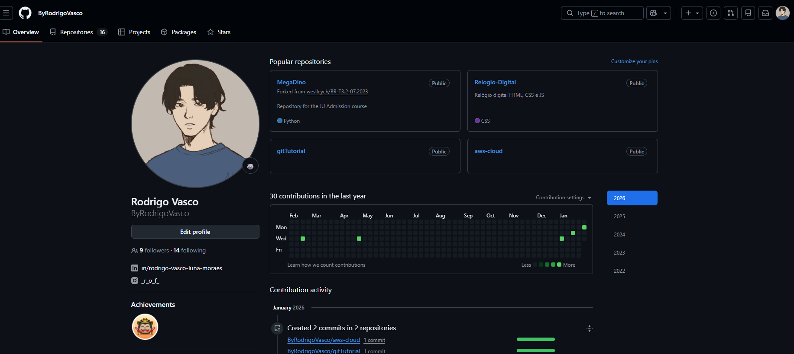
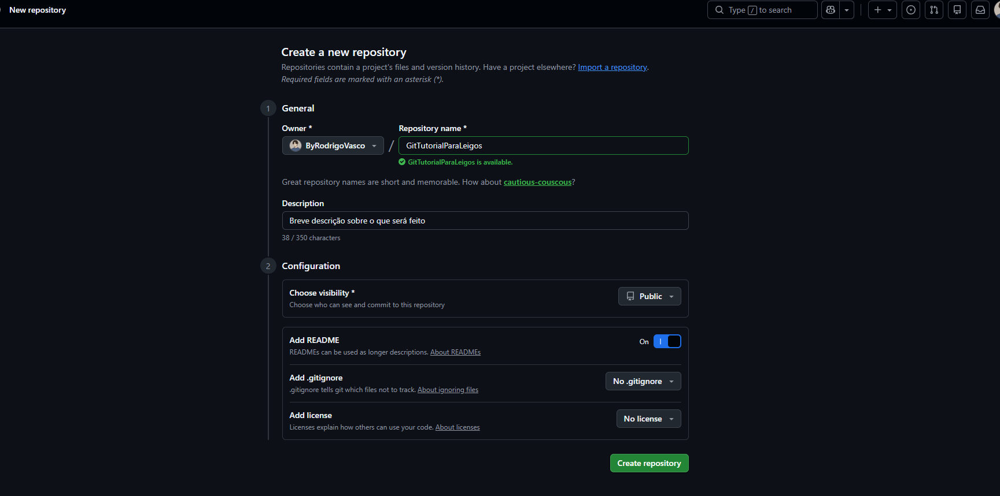
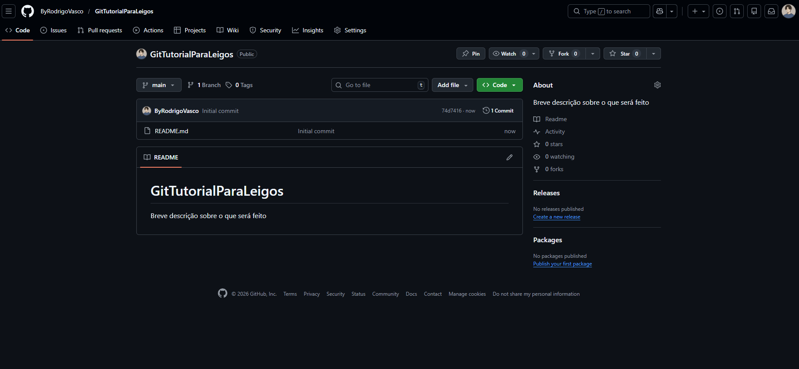
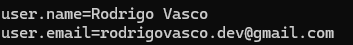
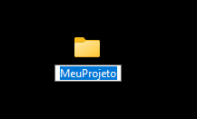
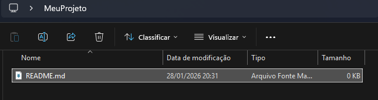
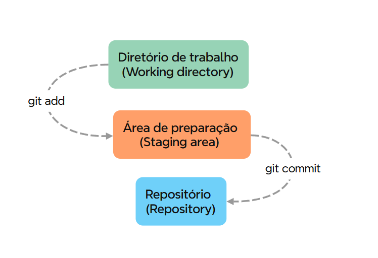
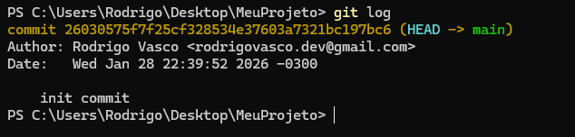
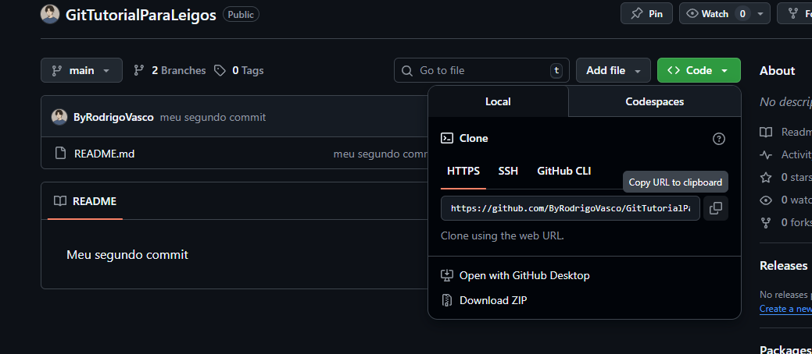
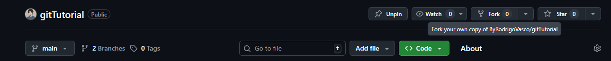

# Git para leigos

## Índice
*   [Introdução](#introdução)
*   [O que é Git?](#o-que-é-git)
*   [Primeiros Passos](#primeiros-passos)
*   [Do zero ao merge](#do-zero-ao-merge)
*


# Introdução
Este repositório é destinado a pessoas que estão dando os primeiros passos no Git e no versionamento de código.

O objetivo é explicar, de forma simples e direta, como funcionam os principais comandos do Git e para que cada um deles serve.

A ideia desse repositório surgiu da necessidade de aprender Git de uma vez por todas e também de criar um material de consulta para quando bater a dúvida ou o esquecimento sobre algum comando específico.

# O que é Git?
O Git é um sistema de controle de versão criado por volta de 2005. Sua origem está relacionada a um conflito entre a comunidade que desenvolvia o núcleo do Linux e a empresa responsável pelo BitKeeper, ferramenta de versionamento utilizada na época, que deixou de ser gratuita.

Diante dessa situação, Linus Torvalds, criador do Linux, decidiu desenvolver uma nova ferramenta que atendesse às necessidades da comunidade: rápida, distribuída e de [código aberto](https://aws.amazon.com/pt/what-is/open-source/).

# O que é, de fato, o Git e como ele funciona?

Como foi dito, Git é um controlador de versionamento [open-source](https://aws.amazon.com/pt/what-is/open-source/). Com ele, você controla a versão do seu código, projeto ou trabalhos.

Vamos imaginar o seguinte cenário, separando o problema e a solução:

Você está em sua casa desenvolvendo uma aplicação onde tem diversas linhas de código já prontas, mas falta energia do nada e seu computador queimou. Você não tem o projeto salvo em um pendrive e tem até o dia seguinte para apresentar o [MVP](https://www.rdstation.com/blog/marketing/mvp-minimo-produto-viavel/) do seu projeto ao cliente. E agora?

Com o Git, você consegue fazer o versionamento do seu projeto, salvando-o em alguma plataforma como o [GitHub](https://github.com/), e pode acessá-lo de qualquer computador ou até visualizar o seu código online. Com o Git, você tem todo o controle de versão do seu projeto e pode recuperar algum código que tenha apagado por qualquer motivo, pode realizar [commits](), criar novas [branches]() e até trabalhar em conjunto com uma equipe no mesmo projeto e na mesma linha de código. Incrível, né? Agora vamos aos primeiros passos de como utilizar essa belezinha.

# Primeiros passos
Para começar a usar a ferramenta, precisamos concluir dois passos principais, que são instalar o Git e ter uma conta em alguma plataforma de hospedagem de repositório Git.

## Criando uma conta no GitHub
O GitHub é uma plataforma online usada para hospedar repositórios Git, permitindo salvar, compartilhar e colaborar em projetos de código. Ele será utilizado aqui para armazenar o projeto versionado e facilitar o acesso de qualquer lugar.
Crie uma conta em uma plataforma web de hospedagem. Neste tutorial, vou utilizar o GitHub.

1. Entre na home do [GitHub](https://github.com/):


2. Clique em **Criar uma conta**


3. Com a conta criada, você terá acesso ao Dashboard. Entre na aba de perfil. Nessa página, você poderá visualizar todas as atividades realizadas no GitHub.



**Ótimo, agora temos uma conta no GitHub!**

## Criando um repositório

Com uma conta no GitHub, vamos criar um repositório. Basta acessar seu perfil GitHub e acessar a aba repositórios e clicar em **New**.


Para criar um repositório, vamos precisar adicionar um nome a ele, adicionar se ele será público ou privado e se queremos ou não adicionar um README, que é um documento de texto, normalmente é utilizado para adicionar explicações sobre o projeto. 

Para esse tutorial não vamos adicionar o README.md agora.



Com o repositório criado vamos ter acesso ao link de clonagem para a maquina local




## Instalando o Git na maquina

Para instalar, basta acessar:
* Este link para [instalação do Git no Windows](https://git-scm.com/)
* Este link para [instalação do Git no Linux](https://git-scm.com/install/linux)
* Este link para [instalação do Git no Mac](https://git-scm.com/install/mac)

## Configurando o git na maquina local

No seu computador, abra o terminal de comando

### Tutorial de linha de comando

A linha de comando é a principal forma de interagir com o sistema operacional, vamos primeiro nos familiarizar com ela antes de continuar.
Vamos usar alguns comandos. É importante saber que dependendo do sistema que está executando seja Windows ou Mac, os comandos podem ser diferentes. Porem, linux e o mac possuem o mesmo gerenciador de pacotes *nix, portanto podem ter os mesmos comandos.

| \\*nix (Linux / macOS) | Windows    | O que faz |
|:----------------------:|:----------:|:----------|
|         `pwd`          | `echo %cd%`| Mostra o diretório atual (onde você está). |
|          `ls`          | `dir`      | Lista arquivos e pastas do diretório atual. |
|          `cd`          | `cd`       | Navega entre diretórios. |
|          `cp`          | `copy`     | Copia arquivos de um local para outro. |
|          `mv`          | `move`     | Move ou renomeia arquivos e pastas. |
|          `rm`          | `del`      | Remove arquivos. |
|        `rm -r`         | `rmdir /s` | Remove diretórios e seus conteúdos. |
|        `mkdir`         | `mkdir`    | Cria um novo diretório. |
|        `clear`         | `cls`      | Limpa a tela do terminal. |
|          `.`           | `.`        | Representa o diretório atual. |
|          `..`          | `..`       | Representa o diretório pai (um nível acima). |


## Definir variaveis globais git

Quando formos utilizar o git, vamos precisar realizar commits, e precisamos rotular esses commits para saber por quem eles foram feitos, tipo uma assinatura.

**Diga ao git seu nome:**
```bash
git config --global user.name "DIGITE SEU NOME AQUI"
```

**Diga ao git o seu endereço de e-mail(o mesmo do GitHub):**
```bash
git config --global user.email "DIGITE SEU E-MAIL AQUI"
```

Para verificar se deu tudo certo:
```bash
git config --list
```


Ótimo agora estamos prontos para subir nosso código!

# Do zero ao merge

Agora com o git instalado e com uma conta criada no GitHub podemos dar inicio ao nosso primeiro projeto versionado. Existem algumas formas de começar a trabalhar com o git, seja iniciando um projeto do zero ou contribuindo em um projeto que já está em andamento.

### Vamos começar criando um do absoluto zero:

1. Crie uma pasta no seu computador, pode adicionar o nome que quiser, ele será o nome seu projeto:

**Por [linha de comando](#tutorial-de-linha-de-comando):**
```bash
mkdir "MeuProjeto"
```

**Manualmente:**



2. Abra a pasta e adicione um arquivo de texto chamado ``README.md``, ``.md`` é uma extensão de arquivos [Markdown](https://www.markdownguide.org/getting-started/), uma linguagem de marcação leve, muito utilizada para e descrever aplicações e guiar os usuários. Esse tutorial está todo em Markdown por exemplo.

**Por [linha de comando](#tutorial-de-linha-de-comando):**
```bash
echo "Olá, esse é meu primeiro commit" > README.md
```

**Manualmente:**


**Para alterar ou adicionar um texto manualmente você irá precisar de uma [IDE](https://github.com/resources/articles/what-is-an-ide?locale=pt-BR), recomendo o [VS code](https://code.visualstudio.com/download)**

### Primeiros comandos Git
Agora é a hora de utilizarmos o git. 

1. Dentro da pasta do seu projeto abra o terminal de comando e digite:

```bash
git init
```

Esse comando irá inicializar o seu repositório, você vai notar que foi criado uma pasta chamada ``.git``, caso não esteja vizualizando ative os arquivos ocultos.
É nessa pasta que toda mágica do git acontece, **então não apague**.

Agora vamos entender o fluxo de trabalho do git:

A imagem abaixo demonstra como o fluxo básico de trabalho do Git funciona.


### 1. Working Directory

É onde você está agora, onde o trabalho realmente acontece, aqui você pode:
* Criar arquivs
* Editar códigos
* apagar coisas
* testar ideias

Nada que é feito aqui está salvo no histórico do Git, ainda. São apenas mudanças locais.

### 2. Staging Area
Aqui é a área intermediária, é onde você escolhe exatamente o que vai entrar no próximo commit

Aqui você pode:

* Revisar os arquivos
* Pode adicionar alguns arquivos e deixar outros fora
* Manter o histórico organizado

### 3. Repository
Aqui é o seu repositório, é onde os seus commits são registrados. É como um arquivo de histórico, onde cada commit é uma "foto" do projeto naquele momento.

Aqui o git:
* Cria um registro permanente
* Salva o estado exato dos arquivos
* Adiciona esse registro ao histórico do projeto


**Você trabalha no directory, seleciona o que é importante no staging area e registra oficialmente no repository.**

**Editar -> Preparar -> Registrar**

Atualmente estamos no Working directory, podemos vizualizar o estado dos arquivos com o comando:

```bash
git status
```

Para passar nossos arquivos para o staging area utilizamos o comando:

```bash
git add ".\README.md"
```

Ao utilizar o comando de status novamente, podemos ver que o arquivo foi adicionado ao saging area e está aguardando o proximo commit.

```bash
git status
```

Isso faz com que o nosso ``README.md`` passe para staging area onde podemos registrar um commit com o comando:

```bash
git commit -m "initial commit"
```

Pronto agora seu codigo está registrado. Esse e outros registros podem ser vizualizados com o comando:

```bash
git log
```


Existe uma forma de criar uma linha paralela de desenvolvimento que permite criar novas funcionalidades sem afetar o registro principal, chamamos isso de Branches (Ramificações).
Normalmente trabalhamos em branches separadas da principal para evitar conflitos de código, erros inesperados e até para testar novas ideias sem interferir com a ramificação principal.

**Comando para criar a ramificação:**
```bash
git branch "nome-da-minha-branch"
```
**Comando para listar todas as branches:**

```bash
git branch -a
```

**Comando para trocar de uma ramificação para outra:**
```bash
git checkout "nome-da-branch"
```
Agora adicione uma novas alterações no arquivo README.md ou adicione novos e faça um novo commit nessa nova branch para praticar.

### Adicionando ao repositório remoto

Por fim vamos jogar nossos commits do repositório local para o repositório remoto criado no passo [Criando um repositório](#criando-um-repositório).

O primeiro passo é associar o repositório local ao remoto utilizando o seguinte comando:

```bash
git remote add origin <link do repositório>
```
``origin`` é o apelido que daremos ao local que estamos subindo nosso repositório.

Por fim com o nosso repositório local conectaco ao remoto do GitHub podemos "empurrar" nossas alterações com o comando ``push``.

*IMPORTANTE:* Antes de realizar o push, precisamos ``SEMPRE`` alinhar o nosso repositório local com o remoto para evitar conflitos, para isso usamos o comando ``pull``.

```bash
git pull origin "nome-da-branch"
```

Logo em seguida com tudo pronto, podemos finalmente subir as alterações com o comando:

```bash
git push origin "nome-da-branch"
```

Agora vamos aprender a mesclar ramficações, unir uma branch na outra. Vamos unir nossa branch criada com a nossa main. Basta utilizar os seguintes comandos:

**Para trocar de branch:**
```bash
git checkout "main"
```

**Para mesclar uma branch na atual:**
```bash
git merge "minha-branch"
```

**Para subir a alteração:**
```bash
git push origin "main"
```

E assim finalizamos o nosso primeiro repositório, primeiro commit, primeiro merge e de quebra ainda aprendemos como funciona todo o fluxo do Git.

### Clonar Repositório

Tá, mas e se eu quiser utilizar esse meu projeto em outra maquina? ou Passar para outros colegas?

Se quiser utilizar esse projeto em outro local basta clonar ele do repositório remoto para sua maquina utilizando o comando ``clone``.

Basta entrar no repositório que deseja, localizar o botão ``code`` na parte direita e copiar o link ``HTTPS``



**E usar o seguinte comando ara clonar repositórios:**
```bash
git clone <link do repositório>
```
Pronto agora o repositório também estará em sua maquina.

### Fork

Mas e se a gente quiser clonar um repositório remoto para outro repositório remoto?

Tem como! Se chama ``Fork`` é uma ferramenta que basta apertar um botão e puff, o o repositório também aparece em sua conta.

Esse botão é localizado na parte superior direita do repositório:



