# Git para leigos

> Um guia prático e direto para quem está começando com Git e versionamento de código.

---

## Índice

**Fundamentos**
*   [Introdução](#introdução)
*   [O que é Git?](#o-que-é-git)
    *   [Para que serve?](#para-que-serve)

**Primeiros Passos**
*   [Primeiros Passos](#primeiros-passos)
    *   [Criando uma Conta no GitHub](#criando-uma-conta-no-github)
    *   [Criando um Repositório](#criando-um-repositório)
    *   [Instalando o Git na máquina](#instalando-o-git-na-maquina)
    *   [Configurando o Git na Máquina Local](#configurando-o-git-na-maquina-local)
    *   [Tutorial de linha de comando](#tutorial-de-linha-de-comando)
    *   [Definir variáveis globais git](#definir-variaveis-globais-git)

**Trabalhando com Git**
*   [Do Zero ao Merge](#do-zero-ao-merge)
    *   [Primeiros Comandos Git](#primeiros-comandos-git)
    *   [O arquivo .gitignore](#o-arquivo-gitignore)
    *   [Como o git funciona](#como-o-git-funciona)
    *   [Primeiro Commit](#primeiro-commit)
    *   [Branches](#branches)
    *   [Git Stash - Guardando alterações temporariamente](#guardando-alterações-temporariamente-com-git-stash)
    *   [Adicionando ao repositório remoto](#adicionando-ao-repositório-remoto)
    *   [Entendendo git fetch e git pull](#entendendo-melhor-o-git-fetch-e-o-git-pull)
    *   [Mesclando branches (merge)](#mesclando-branches-merge)

**Colaboração**
*   [Clonar um Repositório](#clonar-um-repositório)
*   [Pull Request - O que é?](#pull-request---o-que-é-e-por-que-importa)
*   [Fork](#fork)
    *   [Deixar sua Assinatura](#assinar-projeto)

---

# Introdução

Este repositório é destinado a pessoas que estão dando os primeiros passos no Git e no versionamento de código.

**Objetivo:** Explicar, de forma simples e direta, como funcionam os principais comandos do Git e para que cada um deles serve.

**Origem:** A ideia desse repositório surgiu da necessidade de aprender Git de uma vez por todas e também de criar um material de consulta para quando bater a dúvida ou o esquecimento sobre algum comando específico.

---

# O que é Git?

O Git é um sistema de controle de versão criado por volta de 2005. Sua origem está relacionada a um conflito entre a comunidade que desenvolvia o núcleo do Linux e a empresa responsável pelo BitKeeper, ferramenta de versionamento utilizada na época, que deixou de ser gratuita.

Diante dessa situação, Linus Torvalds, criador do Linux, decidiu desenvolver uma nova ferramenta que atendesse às necessidades da comunidade: rápida, distribuída e de [código aberto](https://aws.amazon.com/pt/what-is/open-source/).

---

## Para que serve?

Como foi dito, Git é um controlador de versionamento [open-source](https://aws.amazon.com/pt/what-is/open-source/). Com ele, você controla a versão do seu código, projeto ou trabalhos.

### Cenário do problema:

Você está em sua casa desenvolvendo uma aplicação onde tem diversas linhas de código já prontas, mas falta energia do nada e seu computador queimou. Você não tem o projeto salvo em um pendrive e tem até o dia seguinte para apresentar o [MVP](https://www.rdstation.com/blog/marketing/mvp-minimo-produto-viavel/) do seu projeto ao cliente. E agora?

### A solução:

Com o Git, você consegue fazer o versionamento do seu projeto, salvando-o em alguma plataforma como o [GitHub](https://github.com/), e pode acessá-lo de qualquer computador ou até visualizar o seu código online. Com o Git, você tem todo o controle de versão do seu projeto e pode recuperar algum código que tenha apagado por qualquer motivo, pode realizar commits, criar novas branches e até trabalhar em conjunto com uma equipe no mesmo projeto e na mesma linha de código. Incrível, né? Agora vamos aos primeiros passos de como utilizar essa belezinha.

---

# Primeiros passos

Para começar a usar a ferramenta, precisamos concluir dois passos principais:

1. Instalar o Git
2. Ter uma conta em alguma plataforma de hospedagem de repositório Git

---

## Criando uma conta no GitHub

O GitHub é uma plataforma online usada para hospedar repositórios Git, permitindo salvar, compartilhar e colaborar em projetos de código. Ele será utilizado aqui para armazenar o projeto versionado e facilitar o acesso de qualquer lugar.

Crie uma conta em uma plataforma web de hospedagem. Neste tutorial, vou utilizar o GitHub.

### Passo a passo:

**1.** Entre na home do [GitHub](https://github.com/):


**2.** Clique em **Criar uma conta**


**3.** Com a conta criada, você terá acesso ao Dashboard. Entre na aba de perfil. Nessa página, você poderá visualizar todas as atividades realizadas no GitHub.

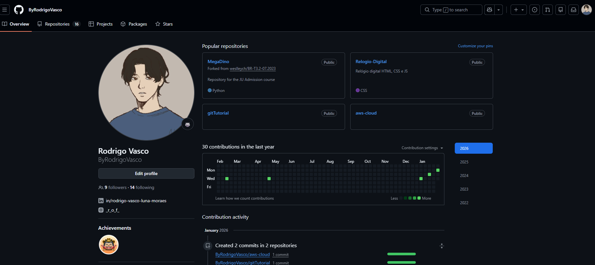

> **Ótimo, agora temos uma conta no GitHub!**

---

## Criando um repositório

Com uma conta no GitHub, vamos criar um repositório. Basta acessar seu perfil GitHub e acessar a aba repositórios e clicar em **New**.


Para criar um repositório, vamos precisar adicionar um nome a ele, adicionar se ele será público ou privado e se queremos ou não adicionar um README, que é um documento de texto, normalmente é utilizado para adicionar explicações sobre o projeto. 

Para esse tutorial não vamos adicionar o README.md agora.

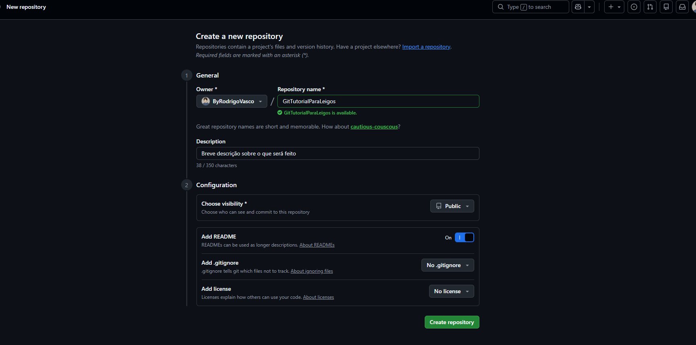

Com o repositório criado vamos ter acesso ao link de clonagem para a maquina local

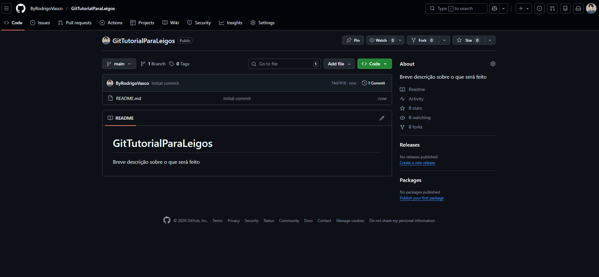

---
## Instalando o Git na maquina

Para instalar, basta acessar:

* Este link para [instalação do Git no Windows](https://git-scm.com/)
* Este link para [instalação do Git no Linux](https://git-scm.com/install/linux)
* Este link para [instalação do Git no Mac](https://git-scm.com/install/mac)

### Tutorial Guanabara: [Instalando o Git](https://youtu.be/NgWExh3bswg?t=148)

---

## Configurando o git na maquina local

No seu computador, abra o terminal de comando.

---

## Tutorial de linha de comando

A linha de comando é a principal forma de interagir com o sistema operacional, vamos primeiro nos familiarizar com ela antes de continuar.
Vamos usar alguns comandos. É importante saber que dependendo do sistema que está executando seja Windows ou Mac, os comandos podem ser diferentes. Porem, linux e o mac possuem o mesmo gerenciador de pacotes *nix, portanto podem ter os mesmos comandos.

### Atalhos para abrir o terminal de comando:
- **Windows**: Tecla Win + R → digite `cmd` → Enter
- **macOS**: Command + Space → digite `Terminal` → Enter
- **Linux**: Ctrl + Alt + T

### Tabela de comandos básicos:

| \\*nix (Linux / macOS) | Windows    | O que faz |
|:----------------------:|:----------:|:----------|
|         `pwd`          | `echo %cd%`| Mostra o diretório atual (onde você está). |
|          `ls`          | `dir`      | Lista arquivos e pastas do diretório atual. |
|          `cd`          | `cd`       | Navega entre diretórios. |
|          `cp`          | `copy`     | Copia arquivos de um local para outro. |
|          `mv`          | `move`     | Move ou renomeia arquivos e pastas. |
|          `rm`          | `del`      | Remove arquivos. |
|        `rm -r`         | `rmdir /s` | Remove diretórios e seus conteúdos. |
|        `mkdir`         | `mkdir`    | Cria um novo diretório. |
|        `clear`         | `cls`      | Limpa a tela do terminal. |
|          `.`           | `.`        | Representa o diretório atual. |
|          `..`          | `..`       | Representa o diretório pai (um nível acima). |


## Definir variaveis globais git

Quando formos utilizar o git, vamos precisar realizar commits, e precisamos rotular esses commits para saber por quem eles foram feitos, tipo uma assinatura.

Abra o terminal de comando e digite os seguintes comandos para configurar o git com seu nome e email:

**Diga ao git seu nome:**
```bash
git config --global user.name "DIGITE SEU NOME AQUI"
```

**Diga ao git o seu endereço de e-mail(o mesmo do GitHub):**
```bash
git config --global user.email "DIGITE SEU E-MAIL AQUI"
```

Para verificar se deu tudo certo:
```bash
git config --list
```

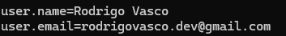

> Ótimo agora estamos prontos para subir nosso código!

---

# Do zero ao merge

Agora com o git instalado e com uma conta criada no GitHub podemos dar inicio ao nosso primeiro projeto versionado. Existem algumas formas de começar a trabalhar com o git, seja iniciando um projeto do zero ou contribuindo em um projeto que já está em andamento.

---

## Vamos começar criando um do absoluto zero:

### Passo 1: Criar uma pasta para o projeto

Crie uma pasta no seu computador, pode adicionar o nome que quiser, ele será o nome do seu projeto:

**Por [linha de comando](#tutorial-de-linha-de-comando):**
```bash
mkdir "MeuProjeto"
```

**Manualmente:**

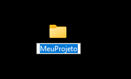

### Passo 2: Criar o arquivo README.md

Abra a pasta e adicione um arquivo de texto chamado ``README.md``, ``.md`` é uma extensão de arquivos [Markdown](https://www.markdownguide.org/getting-started/), uma linguagem de marcação leve, muito utilizada para e descrever aplicações e guiar os usuários. Esse tutorial está todo em Markdown por exemplo.

**Por [linha de comando](#tutorial-de-linha-de-comando):**

```bash
cd "MeuProjeto"
```
em seguida:
```bash
echo "Olá, esse é meu primeiro commit" > README.md
```

**Manualmente:**

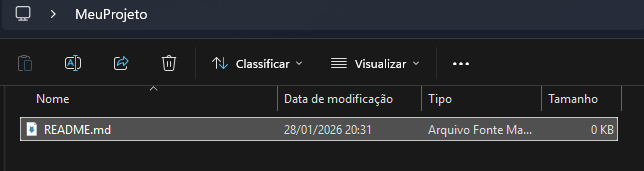

> **Para alterar ou adicionar um texto manualmente você irá precisar de uma [IDE](https://github.com/resources/articles/what-is-an-ide?locale=pt-BR), recomendo o [VS code](https://code.visualstudio.com/download)**

---

### Primeiros comandos Git

Agora é a hora de utilizarmos o git. 

Dentro da pasta do seu projeto abra o terminal de comando e digite:

```bash
git init
```

> Esse comando irá inicializar o seu repositório, você vai notar que foi criado uma pasta chamada ``.git``, caso não esteja vizualizando ative os arquivos ocultos. É nessa pasta que toda mágica do git acontece, **então não apague**.

---

### O arquivo .gitignore

Antes de continuar, é **muito importante** falar sobre o arquivo ``.gitignore``. Este arquivo especial diz ao Git quais arquivos ou pastas ele deve **ignorar** e nunca versionar.

#### Por que isso é crucial?

Existem arquivos que você **NUNCA** deve adicionar ao repositório, repetindo **NUNCA** deve adicionar ao repositório, como por exemplo:

- **Senhas e chaves secretas** (arquivos `.env`, `config.json` com credenciais)
- **Dependências** (pasta `node_modules/`, `venv/`, `vendor/`)
- **Arquivos de configuração da IDE** (`.idea/`, `.vscode/`, `.vs/`)
- **Arquivos de build** (pasta `dist/`, `build/`, `target/`)
- Entre outros...

**Como criar um .gitignore:**

Na raiz do seu projeto, caso não encontre, crie um arquivo chamado `.gitignore` e adicione os padrões que deseja ignorar:

Em seguida adicione os arquivos e pastas que deseja ignorar, por exemplo:
```gitignore
# Dependências
node_modules/
venv/
__pycache__/

# Variáveis de ambiente (SENHAS!)
.env
.env.local
config.json

# Arquivos de IDE
.idea/
.vscode/
*.swp

# Arquivos de sistema
.DS_Store
Thumbs.db

# Build outputs
dist/
build/
*.log
```

**Por [linha de comando](#tutorial-de-linha-de-comando):**

```bash
# Criar o arquivo .gitignore
echo "node_modules/" > .gitignore
echo ".env" >> .gitignore
```

Depois de criar o `.gitignore`, o correto é adicionar ele ao [staging area](#como-o-git-funciona) e realizar um commit para que ele passe a fazer parte do histórico do projeto e atuar como um filtro para os arquivos que não devem ser versionados.


> **Dica:** Você pode encontrar templates prontos de `.gitignore` para diferentes linguagens em [gitignore.io](https://www.toptal.com/developers/gitignore/)

> **IMPORTANTE:** Se você já commitou um arquivo que deveria ser ignorado, apenas adicionar no `.gitignore` não vai removê-lo do histórico. Você precisará usar `git rm --cached nome-do-arquivo` para removê-lo do rastreamento.

---

### Como o git funciona

Agora vamos entender como a **mágica** do git funciona:

A imagem abaixo demonstra como o fluxo básico de trabalho do Git funciona.

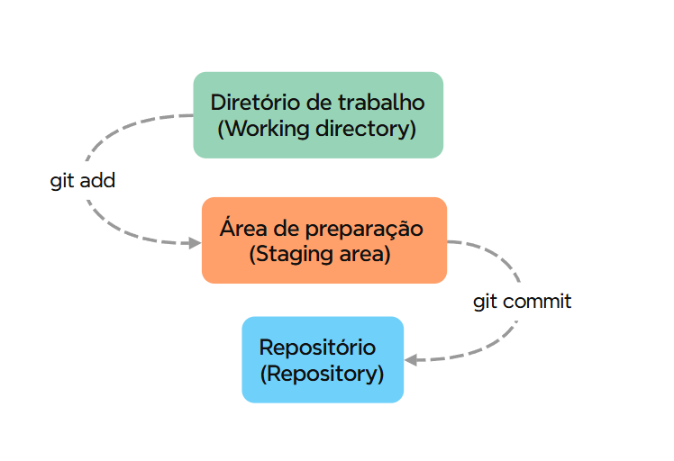

### 1. Working Directory

É onde você está agora, onde o trabalho realmente acontece, aqui você pode:

* Criar arquivos
* Editar códigos
* Apagar coisas
* testar ideias

Nada que é feito aqui está salvo no histórico do Git, ainda. São apenas mudanças locais.

### 2. Staging Area

Aqui é a área intermediária, é onde você escolhe exatamente o que vai entrar no próximo commit.

Aqui você pode:

* Revisar os arquivos
* Pode adicionar alguns arquivos e deixar outros fora
* Manter o histórico organizado

### 3. Repository

Aqui é o seu repositório, é onde os seus commits são registrados. É como um arquivo de histórico, onde cada commit é uma "foto" do projeto naquele momento.

Aqui o git:

* Cria um registro permanente
* Salva o estado exato dos arquivos
* Adiciona esse registro ao histórico do projeto

---

**Você trabalha no directory, seleciona o que é importante no staging area e registra oficialmente no repository.**

> **Resumo:** Editar → Preparar → Registrar

---

## Primeiro Commit

Atualmente estamos no Working directory, podemos visualizar o estado dos arquivos com o comando:

```bash
git status
```

Para passar nossos arquivos para o staging area utilizamos o comando:

```bash
git add "README.md"
```

Se quiser adicionar tudo de uma vez (todos os arquivos modificados no diretorio atual), use:

```bash
git add .
```

Ao utilizar o comando de status novamente, podemos ver que o arquivo foi adicionado ao staging area e está aguardando o proximo commit.

```bash
git status
```

Isso faz com que o nosso ``README.md`` passe para staging area onde podemos registrar um commit com o comando:

```bash
git commit -m "initial commit"
```

Pronto agora seu codigo está registrado. Esse e outros registros podem ser visualizados com o comando:

```bash
git log
```
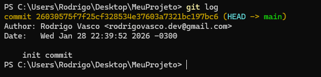

## Branches

Existe uma forma de criar uma linha paralela de desenvolvimento que permite criar novas funcionalidades sem afetar o registro principal, chamamos isso de Branches (Ramificações).

Normalmente trabalhamos em branches separadas da principal para evitar conflitos de código, erros inesperados e até para testar novas ideias sem interferir com a ramificação principal.

### Comandos principais:

**Criar uma nova branch:**
### O que é HEAD?

Antes de trabalhar com branches, é importante entender um conceito fundamental: o **HEAD**. 

O HEAD é um "apontador" (pointer) que indica qual é a **branch atual em que você está trabalhando**. Pense no HEAD como um marcador que diz "você está aqui".

Quando você executa o comando `git checkout` para mudar de branch, o HEAD "se move" para apontar para a nova branch. Por exemplo:

- Você está na branch `main` → HEAD aponta para `main`
- Você executa `git checkout "minha-branch"` → HEAD agora aponta para `minha-branch`
- Qualquer novo commit que você fizer será adicionado onde o HEAD está apontando

Você pode sempre verificar em qual branch (ou seja, onde o HEAD está apontando) usando o comando `git status`. Ele vai te mostrar algo como: `On branch main` ou `On branch minha-branch`.

**Comando para criar a ramificação:**
```bash
git branch "nome-da-minha-branch"
```

**Listar todas as branches:**
```bash
git branch -a
```

**Trocar de uma branch para outra:**
```bash
git checkout "nome-da-minha-branch"
```

Agora adicione uma novas alterações no arquivo README.md ou adicione novos arquivos e faça um novo commit nessa nova branch para praticar.

```bash
echo "Esse é meu novo commit" >> README.md
```

### Guardando alterações temporariamente com git stash

Vão existir situações onde você está trabalhando em uma branch e fez várias alterações, mas **ainda não está pronto para fazer commit**. De repente, você precisa **trocar de branch urgentemente** para corrigir um bug. O que fazer?

Se você tentar trocar de branch com alterações não commitadas, o Git dará um erro reclamando ou vai misturar suas alterações com a outra branch e criar uma bagunça, podendo causar a perda de horas de trabalho em código. É aí que entra o **git stash**!

#### O que é git stash?

O `git stash` é como uma "gaveta temporária" onde você pode guardar suas alterações sem fazer commit. Depois você pode recuperá-las quando quiser.

#### Comandos principais:

**Guardar alterações temporariamente:**

```bash
# Guardar alterações atuais temporariamente
git stash

# Ou guardar com uma mensagem descritiva
git stash save "trabalho em andamento na página de login"
```

Quando você executa isso, suas alterações são guardadas e seu Working Directory fica limpo, como se você não tivesse alterado nada. Agora você pode trocar de branch tranquilamente!

**Recuperar as alterações:**

```bash
# Recuperar a última alteração guardada e REMOVER do stash
git stash pop

# Ou recuperar sem remover do stash
git stash apply
```

**Outros comandos úteis do stash:**

```bash
# Ver lista de tudo que está no stash
git stash list

# Recuperar um stash específico (o número você vê no 'list')
git stash apply stash@{0}

# Deletar um stash específico
git stash drop stash@{0}

# Limpar TODOS os stashes
git stash clear
```

#### Exemplo prático:

```bash
# Você está na branch 'feature' e fez alterações
git status
# (mostra arquivos modificados)

# Guardar tudo temporariamente
git stash save "alterações na tela de login"

# Trocar para branch principal para corrigir bug
git checkout main
# (faz a correção e commit)

# Voltar para sua branch
git checkout feature

# Recuperar seu trabalho
git stash pop

# Continuar trabalhando de onde parou!
```

---

## Adicionando ao repositório remoto

Por fim vamos jogar nossos commits do repositório local para o repositório remoto criado no passo [Criando um repositório](#criando-um-repositório).

### Passo 1: Associar o repositório local ao remoto

O primeiro passo é associar o repositório local ao remoto utilizando o seguinte comando:

```bash
git remote add origin <link do repositório>
```

> **Nota:** ``origin`` é o apelido por padrão que daremos ao local que estamos subindo nosso repositório.
Por fim com o nosso repositório local conectado ao remoto do GitHub podemos "empurrar" nossas alterações com o comando ``push``.

### Passo 2: Alinhar repositório local com o remoto

Por fim com o nosso repositório local conectado ao remoto do GitHub podemos "empurrar" nossas alterações com o comando ``push``.

> **IMPORTANTE:** Antes de realizar o push, precisamos **SEMPRE** alinhar o nosso repositório local com o remoto para evitar conflitos, para isso usamos o comando ``fetch`` e ``pull``.

```bash
git fetch origin
```

```bash
git pull origin "nome-da-branch"
```

### Passo 3: Subir as alterações

Logo em seguida com tudo pronto, podemos finalmente subir as alterações com o comando:

```bash
git push origin "nome-da-branch"
```

---

### Entendendo melhor o git fetch e o git pull

Agora que você já conhece o `git pull`, é importante entender a diferença entre **git fetch** e **git pull**.

#### Git Fetch - "Espiar" o que foi feito no remoto

O `git fetch` **baixa** as alterações do repositório remoto, mas **NÃO** as mescla automaticamente com seu código local. É como "espiar" o que tem de novo sem alterar nada do seu trabalho.

```bash
# Baixar informações do remoto sem mesclar
git fetch origin

# Baixar de uma branch específica
git fetch origin main
```

Depois de fazer `git fetch`, você pode:

- Ver o que mudou sem afetar seu código
- Decidir se quer ou não mesclar
- Comparar as diferenças

> Utilizem sempre antes de fazer um `git pull` para revisar as mudanças e evitar dor de cabeça depois! ~~Quem avisa amigo é!~~

#### Git Pull - Baixar e mesclar automaticamente

O `git pull` é na verdade uma **combinação** de dois comandos:

```bash
git pull = git fetch + git merge
```

Ou seja, quando você faz `git pull`, o Git:

1. Baixa as alterações do remoto (fetch)
2. Imediatamente mescla com sua branch atual (merge)

> **Dica:** Sempre use o `git fetch` primeiro quando estiver trabalhando em equipe e quiser revisar as mudanças antes de mesclar.

---

### Mesclando branches (merge)

Agora vamos aprender a mesclar ramificações, unir uma branch na outra. Vamos unir nossa branch criada com a nossa main. Basta utilizar os seguintes comandos:

**Trocar de branch:**
```bash
git checkout "main"
```

**Mesclar uma branch na atual:**
```bash
git merge "minha-branch"
```

**Subir a alteração:**
```bash
git push origin "main"
```

---

E assim finalizamos o nosso primeiro repositório, primeiro commit, primeiro merge e de quebra ainda aprendemos como funciona todo o fluxo do Git.

---

# Clonar um Repositório

Tá, mas e se eu quiser utilizar esse meu projeto em outra maquina? ou Passar para outros colegas?

Se quiser utilizar esse projeto em outro local basta clonar ele do repositório remoto para sua maquina utilizando o comando ``clone``.

Basta entrar no repositório que deseja, localizar o botão ``code`` na parte direita e copiar o link ``HTTPS``

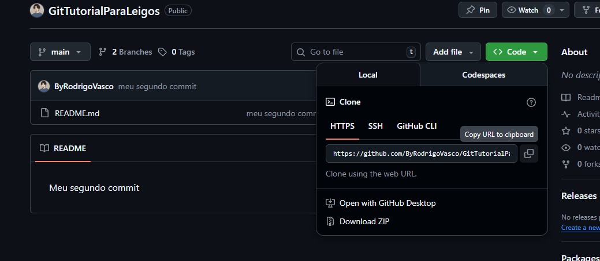

**Usar o seguinte comando para clonar repositórios:**
```bash
git clone <link do repositório>
```

Pronto agora o repositório também estará em sua maquina.

---

# Pull Request - O que é e por que importa?

Antes de aprendermos sobre Fork e contribuições, é fundamental entender o **Pull Request**, o famoso PR.

## O que é um Pull Request?

Um Pull Request é um pedido formal de contribuição. É você dizendo ao mantenedor do projeto original: "Olá! Eu fiz umas melhorias/correções no código. Você poderia revisar e, se achar bom, incorporar no projeto?"

Não é um "push direto" porque existe um processo de **revisão e aprovação** antes de suas mudanças entrarem no projeto principal.

---

# Fork

Mas e se a gente quiser clonar um repositório remoto que não é meu para minha conta GitHub?

É possível! Isso se chama ``Fork`` é uma ferramenta que basta apertar um botão e puff, o repositório também aparece em sua conta, e agora também é seu e você pode contribuir com o repositório original.

Vamos testar com esse repositório de tutorial? 

## Assinar projeto

Hora de praticar tudo que aprendeu até aqui.

> Deixe a sua assinatura nesse repositório seguindo os passos abaixo

### Passo a passo:
O botão do ``Fork`` é localizado na parte superior direita do repositório, como na imagem abaixo:

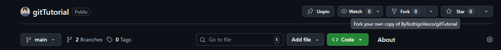

Após clicar nele você será redirecionado para a pagina de criação do fork, basta confirmar:

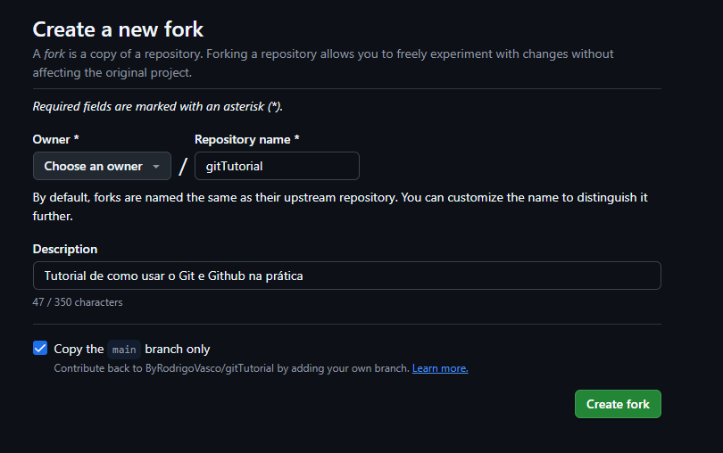

### Seguir os passos aprendidos

Agora basta seguir os passos que aprendeu:

**1.** Clonar o repositório seguindo os passos de como [Clonar um repositório](#clonar-um-repositório).

**2.** Criar uma branch seguindo os passos de como [Criar uma Branch](#branches).

**3.** Acessar o arquivo [CONTRIBUTING.md](CONTRIBUTING.md).

**4.** Deixar sua assinatura seguindo os passos do arquivo.

**5.** Registrar commit da alteração seguindo os passos do [primeiro commit](#primeiro-commit).

**6.** Subir para o repositório remoto seguindo os passos de como [Adicionar ao repositório remoto](#adicionando-ao-repositório-remoto)

### Criar o Pull Request

Após finalizar retorne ao repositório no GitHub. O fork sempre tentará comparar o código com o repositório original, então assim que subir a sua branch nova ele irá recomendar a criação de um pull request no repositório original.

**Clicar em** ``Compare & pull request``

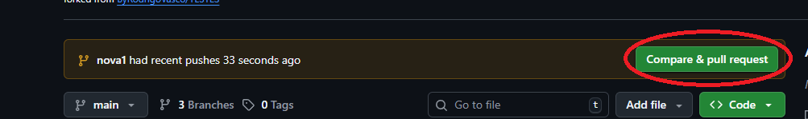

Basta adicionar um titulo e uma descrição e clicar em ``Create pull request``.

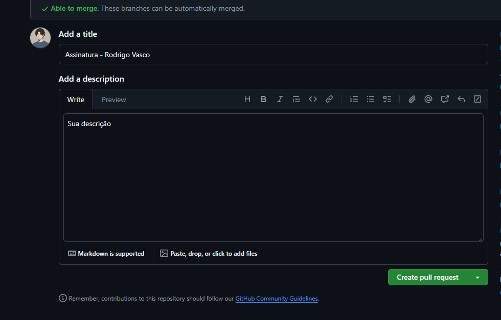

---

**Pronto! Missão concluída com sucesso!** 

> Sempre que possível irei atualizar esse repositório com a assinatura dos participantes!


Se chegou até aqui, primeiramente obrigado por ter tido a paciencia de ler tudo, e segundamente, parabéns por ter dado os primeiros passos nesse mundo de bruxaria do git.
